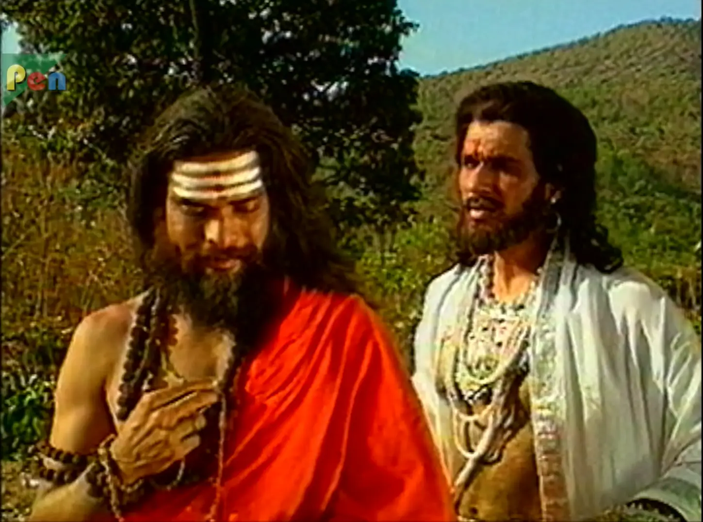
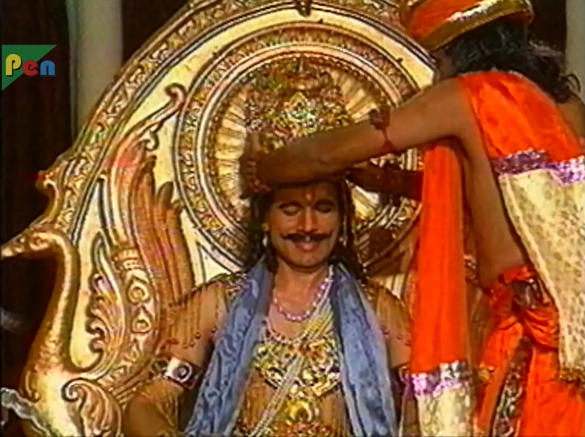

#### NOTE: 
***I have added a commenting functionality to the site, it is for mail-in comments so it may or may not be up your lane. Try it if you feel like!***

After feedback from the exactly three people that read this website, I have discovered that the series seems like a story retelling and not a discussion. So after this one, all the episdode discussions that are posted on this site will have three sections, viz. Synopsis, Discussion, and dialogue. I will not follow the story scene by scene but rather give a short synopsis of that episode and then the discussion section will have the questions that arise in the audience's minds. It will also feature tidbits about the production quality of the show. The extras section will have notable dialogue and scenes, if any.

#### Recap

In the previous episode we left our major character Bhishma at a dilemma,
to keep his vow or to obey his mother. Now the story will move on much
quickly as the foundations for the battle have been set. 

#### The birth of Pandu, Dhritrashtra and Vidur

>..pratigya me hi Kshatriya ke praan hote hai..

Bhishma is on a quest to find answers from Maharshi vyas. A learned Guru who might help them solve the problem of heirs for the Kuru dynasty. One issue that stuck with me is that why do they need to find someone from the Kuru dynasty after the death of the princes? Bhishma's Pratigya was for Satyavati's children taking the throne and himself rejecting it. Why was it an issue now? Satyavati had no children and since Hastinapur was a democracy, Bhishma was very well capable of choosing a new king himself! 

The backstory of Satyavati is bizzare, to say the least. Back when she was young, she met a Rishi while ferrying people across the river. She was called "matsyagandha"(The one who smells like fish) back then, given the fact that her father was a fisherman and she was in the water all day. While the story is pretty interesting, it was skipped in the show. I am writing it here for the readers. She met parasar Rishi in the boat and he said that they need to have a child for the future of the nation. Satyavati protested that she was akalank(without a stain) and would not want to do that. The rishi assures her that he will leave her akalank either way, by miracle I guess. That day, they had a child, and he turned out to be Maharshi Vyas. Parasar Rishi also gave her a boon that turned her into ***yojangandha***(The one who's smell lingers for yojans.) The same smell that pulled Shantanu to her. In a way the story of Mahabharat had started taking place that day itself. Ved Vyas is the person who wrote the Mahabharat in its true form by the way, if you didn't already know.

The only solution to this apparent heir problem was for Satyavati's only son (Vyas) to procreate with Ambika and Ambalika. Since this was a time of curses and magic stuff, when Ambika goes to have a child with Vyas, she gets terrified of his appearance and closes her eyes. Vyas predicts that because she did this, her child will be born without sight. If you are even slightly familiar with Mahabharat, we know who this is. Ambalika on the other hand is also terrified of Vyas' appearance but instead of closing her eyes, she turned pale. Due to this her child will be born with poor health(pale skin). Putting aside the story for a while, Satyavati is looking for the future of the kingdom and forgets about the present of the princesses. The princesses that just lost their husband are now forced to have children with the long lost step brother of their husbands who is a sadhu. That is a hard thing to do. Instead of going for the third time to Rishi Vyas, they send a *dasi*(maid) to Vyas. The maid does not blink an eye and thus gets the boon that the child will be born wise and will be revered by the world. Three different destinies, woven together. Dhritrashtra, Pandu and Vidur. Different people, different personalities, and common progenitor.

Again, some story is lost in narration. We don't get to see the coming of age of the three children. Dhritrashtra, Pandu and Vidur are grown up middle-aged men now. They seem to have spent their childhood under the able hand of Bhishma and grown into wise men.

Its as if Vidur is speaking the audience's mind, he questions the eligibility of the blind Dhritrashtra as the king of Hastinapur. While the throne should belong to Dhritrashtra by law, we know that laws in Hastinapur bend to the wills of the people that rule it. Dhritrashtra accepts what Vidur suggested and in the end it falls to the apparent matriarch of the family to decide the future of Hastinapur. Satyavati chooses Pandu as the king of Hastinapur and rightly so. A king in poor health is better than a blind king.

**Other notable dialogue:**

>Koi vachan maa, aur maatrabhumi se bada nahi hota sakta gangaputra
>
>Ye nirnay to vachanbaddh hone vale ko hi lena chaiye na munivar

>Manushya swayam kabhi apne aap ko nahi pehchaan sakta

>Itihaas tumhaari pratiksha kar raha hai

>Muje na jaane ye kya ho gaya hai, jo jaanti hoon, use hi jaan ne ka prayatna kar rahi hoon

#### To be continued

