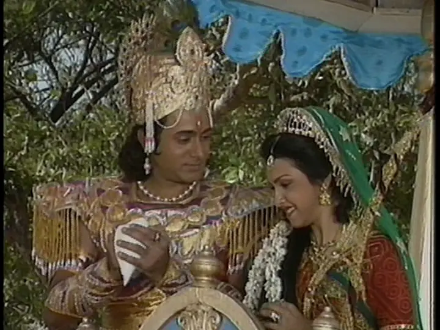
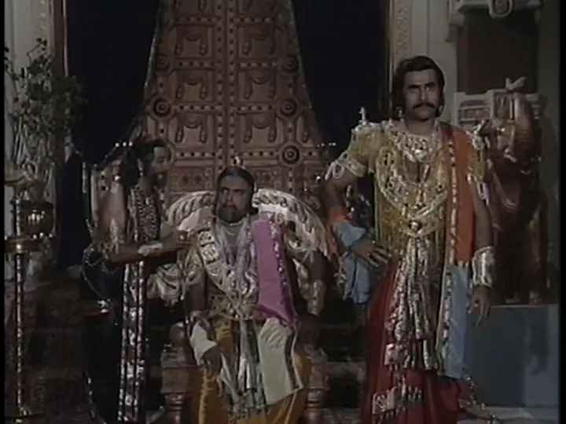

#### Rukmini's rescue
> Yadi mujhe koi sachmuch pukarta hai, to mujhe aana hi padta hai.. aur kisi pukaar ko sunkar turant aa jane se bada anand koi nahi

#### Synopsis 
Shri Krishna receives a letter from Rukmini asking him to take her away from
Vidarbha before she is forcibly married to Shishupal. Krishna goes to her
rescue. Meanwhile, Dhritrashtra battles his own decisions as the pressure of
naming the king falls upon him. Shakuni and Duryodhan manipulate Dhritrashtra
into sending Yudhishthir to a trap. Bhishma and Vidur start suspecting Shakuni
as the snake in the palace.

#### Discussion 
The story continues from the previous episode, when princess Rukmini sends a
letter to Shri Krishna requesting him to come rescue her. Krishna receives that
letter and plans to get her from Vidarbha kingdom. The "samay" monologue speaks
in length about how the decision of marriage is supposed to be a joint decision
and not a forced relationship. What king Bhishmak and Rukmi plan to do is
against humanity itself, and who better to stop them, than the saviour of
humanity Shri Krishna? In his usual calm demeanor Shri Krishna rescues her and
ties up Rukmi who tries to stop them. Krishna doesn't blame Rukmi for trying to
stop him, as is his Dharma.

Then there is that beautiful scene where Sanjay is driving Dhritrashtra to some
location and they talk about truth. Dhritrashtra asks Sanjay to be his eyes, to
be the one sense that Dhritrashtra wants more than anything. Sanjay asks if he
can trust him with such a big task, and Dhritrashtra says yes. But He seems
almost desperate to see what greenery is. He asks Sanjay what does smell look
like? What is the color of sound? To which Sanjay replies with nothing but
silence. Dhritrashtra then asks him for the truth, and when Sanjay finally
gives it to him he can do nothing but order him to go back to the palace. The
place where dharma perishes everyday.

On the other hand, Duryodhan seems to be giving away the royal treasury to
anyone he comes across in hopes of gaining the people's favor. He hopes that
the people will remember what he gave to them when the time to vote comes, but
he is wrong. Just like today's politics. No matter what you give to the people,
they will vote for who they feel is right. Meanwhile Shakuni brings a new
scheme to his nephew Duryodhan and it involves more than just minor tricks. He
plans to bring Pandavs to a wax palance (Laksha-grah) and burn them alive.
Dhritrashtra still has love for his brother's sons. He refuses to treat them as
anything other than his own blood. That doesn't stop Shakuni and he uses
Duryodhan to manipulate Dhritrashtra into sending Pandavs to a festival where
he has laid the trap. 

This episode ends with Vidur informing Bhishma about Shakuni's malice and both
of them being worried about the near future. Giving access to the Royal
treasury to Duryodhan was a mistake. He is emptying the resources in hopes
becoming the king, but what will he be king of when nothing is left to rule?

On a lighter note, there were two funny moments in this episode: 

1. There is no need to describe it. I will show it to you.

	

2. This interaction between Shakuni and Dhritrashtra. Dhritrashtra's comic timing can only be explained when you watch this live.

	> Shakuni: Mera priya Duryodhan satya keh raha hai maharaj!
	>
	> Duryodhan: Parantu tumhara priya Duryodhan, keh kya raha hai Gandhar kumar!

#### Notable dialogue
> Sanjay, tum meri aankhe ban jao

> Maine tumhe satya bolne ki aagya di hai Sanjay, prashn karne ki nahi.

> Main to aapka saarthi hoon Maharaj, main to keval yahi chahta hoon ki aapke rath ko keval unn patho par lekar jaaun, jo aapke suraksha ke path ho.

> Rajneeti ka pehla niyam yeh hai, ki Raja ke mann ki avastha ka uske mann ke atirikt kisi ko gyaan hi nahi hona chahiye. Aur tumhara mukh mandal to bhoj patra ki bhaanti koi bhi padh sakta hai.

#### To be continued
