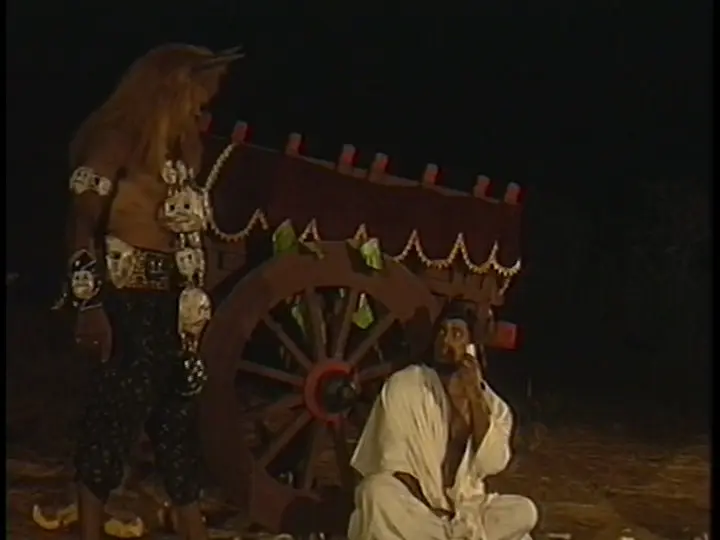

#### Bakasur Vadh
> Ye yug adarsho ka yug nahi hai. (This is not an age of ideals.)

#### Synopsis 
Vidur informs Bhishma of the Pandavs' whereabouts but advises against visiting
them. Meanwhile, the Pandavs are posing as Brahmins and staying with a Brahmin
family in Ekchakranagri. The town has a deal with a demon named Bakasur, who
demands a human and a cart of food every week. This week it is the Brahmin
family's turn, and Kunti offers to send Bhim to confront Bakasur. Bhim kills the
demon, bringing peace to the village.

#### Discussion 
In this episode, we see Hastinapur only once, when Bhishma asks Vidur where the
Pandavs are staying. Vidur tells him out of respect but advises against
visiting them, suggesting that he may have a bigger plan. Meanwhile, the
Pandavs are living happily as Brahmins in the town, begging for alms and
staying with their hosts. We see a contrast between the Bhikshuk (beggar) of
then and now, with people today less likely to show respect to beggars.

When the Pandavs return from begging, their mother Kunti tells them to divide
the food equally, setting up a pivotal point for the future. While the four
Pandavs are living in exile, Bhim has married Hidimba and is living with her.
They now have a newborn baby, giving us an idea of the timeline. According to
their agreement, Bhim must leave Hidimba after the baby's birth. They have a
heartfelt conversation about the role of a mother and her claim over the child.

This episode is full of sweet moments. When Kunti asks why their host is crying
about Bakasur, he tries to hide his pain, but Kunti reminds him that guests
have rights as well as responsibilities to their hosts. The family also shares
a touching moment when they are willing to sacrifice themselves for one
another. The brothers object to sending Bhim to confront Bakasur, but Bhim
reminds them that he owes them for always taking half of their food. The
chemistry between the Pandav brothers is fantastic in this episode.

The show has tried to convey progressive messages throughout the series. In
this episode, it addresses the issue of killing girl children, which was once
prevalent in (modern) old India. The Brahmin states that killing a girl child is equal to
the sin of killing a whole generation and that he would rather die than let his
daughter be killed.

Finally, the fight between Bhim and Bakasur is intense and exciting, with Bhim
using his signature move of punching Bakasur's chest. The fight gets a bit
gory when Bhim pulls off Bakasur's horns and stabs him in the chest, but it is
still a fun watch.

-------------------------
#### Notable dialogue

> Maa ki kokh sagar ko samaye huye hai [...] swayam narayan bhi maanav roop me
> janam le, to maa ki jalakh paa ke swayam ko dhanya samjenge.
> (A mother's womb contains a sea of love, even Narayan himself will feel blessed if he gets to become human and feel the love of a mother.)

<!--- --->

>tumhari (his daughter) hatya, ek pure vansh ki hatya ke barabar hai.
(Killing you is like killing a whole generation.)

<!--- --->

>Jis rajya ka raja kaayar ho, durbal ho, uss rajya ke logo ko grihasthi jeevan
>hi tyaag dena chahiye.
>(The people of a state whose king is a weak coward, should give up household
lives.)
<!--- --->

#### To be continued
