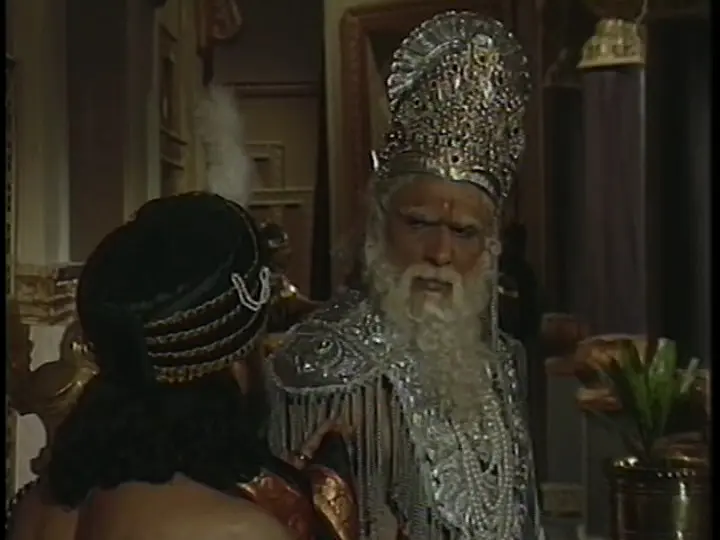
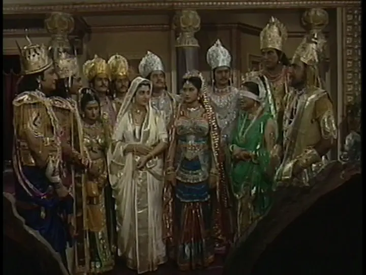
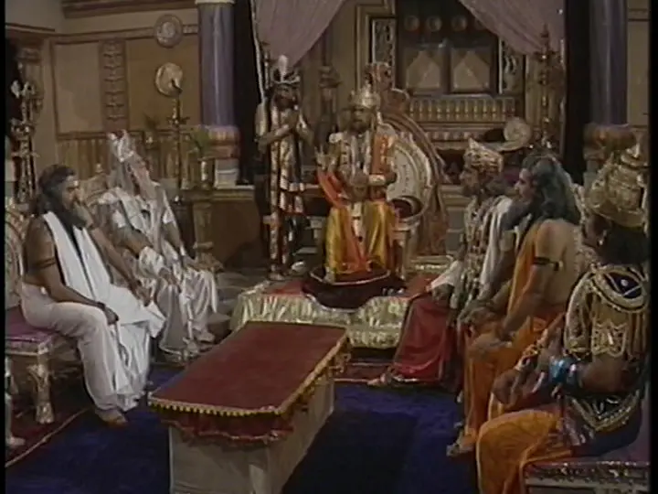
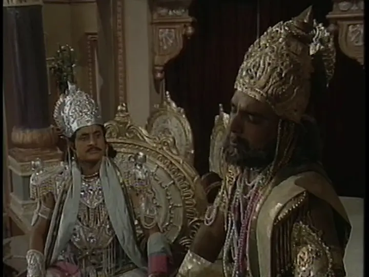

#### Hastinapur is Divided.
> Is prashn ko lekar ya toh vidhata ke paas jao, ya kaal ke paas. Is aakash se pucho jisme bhavishya ka bij hai, ya is dharti se jisme uska ankur phootega. Main toh sirf shunya hoon, agar main akela hoon, to mere paas koi arth nahi hai.

#### Synopsis
The Pandavas return to Hastinapur where they receive a grand welcome. Everyone celebrates, except those responsible for the Pandavas being away in the first place. Bhishma is torn between his vow and what is right. The elders and King Dhritrashtra gather to decide the future of Hastinapur. Everyone leaves it to Bhishma, who declares that Hastinapur should be split in two. Dhritrashtra convinces Yudhishthir to leave Hastinapur and build Khandavprastha.

#### Discussion
This is the first time I am actually happy writing a review. There was some substance to the episode in a long while. Or maybe this time I did it for myself instead of just completing the series for the sake of it. So without further ado, let's begin...

There were many candid talks in this episode - Bhishma with Duryodhan, Shakuni with Bhishma, Ganga with Bhishma, Krishna with Arjuna, and Dhritrashtra with Yudhishthir. All of them reveal more about the characters we have been following for the past 36 episodes. Bhishma meets with his mother Ganga to ask her for a solution to this grave dilemma he's in. She says what the audience has been trying to convey for quite some time now: you have to own up to your vows. He did not consult her when he took those vows, so why does he come to her for help now? But Bhishma is Bhishma, and his word is his bond, so he vows not to come to her again. The next time they meet, she will be the one to come.

Duryodhan tries to explain to Bhishma why he is the righteous king and why he is fighting for the throne. If he doesn't, then his _kshatriya dharma_ will not hold true. It is in his nature to fight. He has been told since he was a child that the throne is his. It is not his fault that he is doing everything in his power to fight for it now. Bhishma, upon hearing this, makes another promise that he will not enjoy fulfilling. He promises to try and do everything he can to make sure Duryodhan gets his right. This made me wonder if Duryodhan is smart enough to realize the conditioning his uncle and father subjected him to throughout his childhood, why is he not mature enough to understand his wrongdoings?

The whole town is filled with joy when the Pandavs arrive, although the background actors were really lifeless in the video. Duryodhan throws another temper tantrum by not coming to welcome his brothers. When Draupadi takes everyone's blessings, she also seeks the blessing of _Kulguru_ Kripacharya. This made me think about the meaning of _Kulguru_ in the modern context. Who is a _Kulguru_ in this fast world? Is there even a place for a _Kul_, let alone a _KulGuru_?

Shri Krishna tries to get the blessings of the elders, but they are elders for a reason. They recognize _Sakshat Bhagwaan_ when they see him and refuse to give blessings. Why would the blessor of the whole cosmos need anyone's blessings? You can hear the pain in Bhishma's voice when he is welcoming the Pandavs one by one. That's the pain of a man who knows that he might have to cast out those he is welcoming right now, no matter how dear they are to him. Unlike him, Draupadi has no idea what is coming her way, and the tragedy that she will have to be a part of in the near future. She is happy to be a part of the _Kuruvansh_ as its daughter-in-law.

Dhritrashtra, when talking about his blindness, says that when blind people get a hold of people or things, they try not to let them go - lest they might never hold them again. This kind of rings true for [old people](/posts/getting_old) as well. They hold on to family, friends, and possessions until the last moment. It is painful to watch, to see someone wither away into a shell of their past selves.

When Bhishma makes the decision of splitting Hastinapur in two, you can see the conflict in his heart. No matter what Shakuni or Vidur say, they don't have a dilemma. Everyone has picked sides, except Bhishma. The lonely titan.

This episode feels like _that_ point in any story when you get to see the good side of all characters, because something tragic is going to happen to them. Draupadi gets a new home, the Pandavs get to live with their family. Everyone is happy. Until they won't be. Last but not least, Dhritrashtra's _blind_ (get it?) love for his son gets in the way of _dharma_ again. He convinces Yudhishthir to leave Hastinapur.

#### Notable Dialogue
> Gale nahi lagoge, putra?
>
> Mere vastraon par to yatra ki dhool hai, pitamah, aapke shvet vastra maile ho jaayenge.
>
> Mere shvet vastra toh, sadaiv hi tumhari dhool ke liye vyakul rehte hain, putra.

> Rang to agni jaisa hai [about Draupadi].

> Kaan laga ke suniye dau, aaj to swayam raat bhi jaag rahi hai. Tulaa ki dandi ganga putra Bhishma ki chhati mein gadi hui hai.

> Duryodhan ka abhimaan, mere aur uske beech ki deewar hai.

-------------------------

#### To Be Continued
