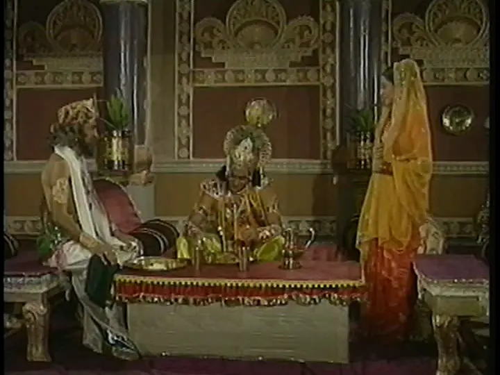

#### Khandavprastha
> Duryodhan apne aap mein kuch hai hi nahi. Ve Maharaj Dhritrashtra ke vriksh ki ek shakh hai. Aur vriksha dharti ke tukdon se apni jaden bandhe hote hain. Nato vo aage ja sakte hain, nahi piche hat sakte hain. Ve keval tut kar gir sakte hain, Acharya, ya fir paristhiti ki agni ka indhan banne ke liye kaate ja sakte hain.

#### Synopsis
After the decision of dividing the kingdom is made, all Pandavs are ready to go
to war with the Kauravs except Yudhishthir. Being the voice of reason he calms
them down and explains why this could be a good thing for the people. Shakuni,
still unsatisfied with making Duryodhan the king of Hastinapur starts scheming
once again. He sets Duryodhan on a mission to get Balram on their side. Bhishma
tries to rationalize his mistakes. Duryodhan manages to get Balram dau on their
side.

#### Discussion
This is another episode with strong dialogue. This series was very dialogue
heavy, and I think that is what made it popular. The grand characters were 
carried by their words. Today, to cater to modern audiences the series are
filled with tons of CGI, filler content that deviates wildly from the main
story line and an overall butchering of characters. This is my personal
opinion, put your pitchfork back down.

The decision is made to give the land of Khandavprastha to Pandavs. According
to some online research it was situated on the western coast of Yamuna river.
Inhabited by _asurs_ and _nagas_, it was a cruel infertile region. This
decision obviously angers Bheem and other Pandavs except Yudhishthir. He seems
to be taking the route of being the bigger man and not starting any wars. When
Krishna has declared that this is the _Karmbhoomi_ of Pandavs, then that is
what it shall be.

Dhritrashtra acknowledges his faults and his blind (_get it?_) love for his son
in a rare moment of honesty. He is a lesson to all fathers on how *NOT* to love
your children. As expected from Shakuni, he is still unsatisfied with what
Duryodhan has been given. He wants everything. The symbol of blatant greed in
Mahabharat. Dhritrashtra does it for his son, although misguided, it is love.
For Shakuni it is revenge and greed. Nothing positive. However, doing this will
require more than just him, Dushashan and Karna on Duryodhan's side. He gets
Duryodhan on a mission to win the allegiance of Balram. If the Pandavs have
Shri Krishna, they should have someone as well.

Shri Krishna goes for a meal at Vidur's home. _Sarso ka saag_ and _Makke ki
roti_. I was watching this episode with my mama and he told me that whenever
Shri Krishna visited Hastinapur, he would always eat at Vidur's place. The
reason for this being that Vidur was the only one who made the right decisions
in the whole of Hastinapur. Right in the sense of _Dharma_.

So while Duryodhan takes Balram to feed him good food and get him on his side,
Shri Krishna visits the three pillars of Dharma in Hastinapur. Drona, Vidur,
and Dhritrashtra. Ironically, they are tied in their allegiance to the throne
and will not be able to fight on the side of Dharma when the war begins. He
tells them not to oppose the decision that's been made and let things be. 

One of the highlights of this scene was Arjun practicing archery in the Dark
and Bhishma visiting him. It was cinematic. It would have been the highlight of
this episode if it was shot with modern tools. Bhishma presents an interesting
perspective here. If Pandu never became king, then Dhritrashtra would never
have developed this complex. It was a mistake making the younger brother king.
If Dhritrashtra stayed king for his whole life from the get go, then he would
never be insecure about his position and would be able to think rationally on
who to give the kingdom to. Maybe he would have gladly chosen the Pandavs. What
do you think of this? Let me know!

#### Notable Dialogue
> "Adhikaar" shabd ka arth itna sadharan nahi hai, Priya Anuj. Adhikaaron ka
> daam chukana padta hai. Ek adhikaar ke saath anek kartavyon ka palan karna
> padta hai.

> Shanti ki khoj mein yadi chakra-dhari Krishna Mathura chhod kar Dwarka jaa
> sakte hain, toh hum Khandavprastha kyun nahi jaa sakte.

> Neend meri dasi nahi hai, Gandhari.

> Main hi ranbhoomi hoon, aur main hi apna pratidvandi bhi. Apne swayam se mera
> yudh chal raha hai, aur main nahi jaanta ki is yudh mein kaun jitega.

> Arjun vo nar hai, jo Narayan ke darshan karwayega.

> Krodh ka sabse bada dosh yahi hai, putra, ki vo doshi aur nirdosh ke beech ka
> antar nahi kar sakta.

> Ye ganit ke kis niyam ne mujhe tumse bada bana diya hai, Krishna?

-------------------------

#### To Be Continued
