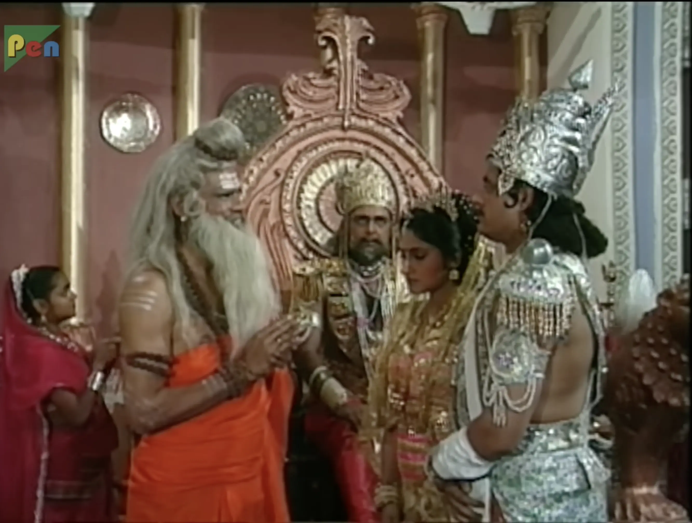

NOTE: It has been a while since I wrote a review. Almost a year now I guess. I have been busy with work and other
things. But I am back now. I will try to be more regular with my reviews. Here is the latest on in the series :)

#### Indraprastha

> Krishna: Iss sannate se bhramit mat ho Parth! Isske piche jo aandhi bann rahi hai uski aahat suno.
>
> Arjun: Aandhi?
>
> Krishna: Haan, Duryodhan ke ghayal abhimaan ki aandhi.

#### Synopsis

Hastinapur is divided in two parts. One for Yudhisthir and one for
Duryodhan. Yudhisthir is given the region of Khandavprastha and the remaining is kept
with Dhritrashtra until Duryodhan is crowned king. Ved Vyas is called to coronate Yudhisthir.
When they reach Khandavprastha, they find it to be a barren land. Krishna tells them that
this is their _Karmbhoomi_ and they should make it their own. They start terraforming the
land with the help of Krishna and Balram and build Indraprastha. Krishna suggests working on defences of Indraprastha.

#### Discussion

In this episode, amidst Hastinapur's division, every action carries a weighty symbolism, foreshadowing the characters'
fates and the impending conflicts. Ved Vyas's blessings upon Draupadi, veiled in cryptic advice, hint at her forthcoming
trials and pivotal role in the unfolding drama. Gandhari's plea to Yudhisthir echoes the looming threat of familial
discord, casting a shadow over their lineage. 

Despite Bhishma and Drona's warnings against war, their words predict the
looming threat of war on the horizon. Yet, amidst these omens, the transformation of Khandavprastha into
Indraprastha emerges as a positive outlook. The sweet montage, accompanied by such a cool old school hindi song,
captures the story of shaping destiny against all odds. 

And in the closing scene, the conversation between Arjun and Krishna set up the upcoming plot related to his marriage and coming war. Overall, a pretty standard episode of Mahabharat overall.

#### Notable Dialogue

> Vivah ki gaanth bahot hi dridh aur varishth hoti hai.

> Mere aashirvad kisi tilak ke aadhin nahi hai putra Arjun.

> Aadha raj nikla nahi mama shri, aadha raj mila hai.

> Krishna: Pranam Rishivar
> 
> Ved Vyas: Pranam nahi Devkinandan, parinaam kaho.

> Jeevan ek sagar hai putra, aur ise mathna tumhara adhikaar hai. Parantu dhyan rahe putra,
> is manthan se nikalne vaale amrit ke saath saath, vish ke adhikari tum hi hoge.

> Gandhari: Iss rajya ka vibhajan bhale hi ho gaya ho, parantu ye rajparivar ka vibhajan kabhi na ho.

> Bhishma: Iss rajya ke sath mera vibhajan bhi ho gaya hai putra.

> Kshatriya ka jeevan jine ke liye nahi hota. Kshatriya ka jeevan manav adhikaro ki raksha karte karte mar jane ke liye hota hai.

> Kshatriya ko rann bhoomi ki aur tabhi dekhna chahiye jab koi aur marg khula na ho.

> Kisiki kripa kisiki karmbhoomi nahi ho sakti. Apni karmbhoomi ke patthar to swayam ko hi todne padte hai.
 
---

