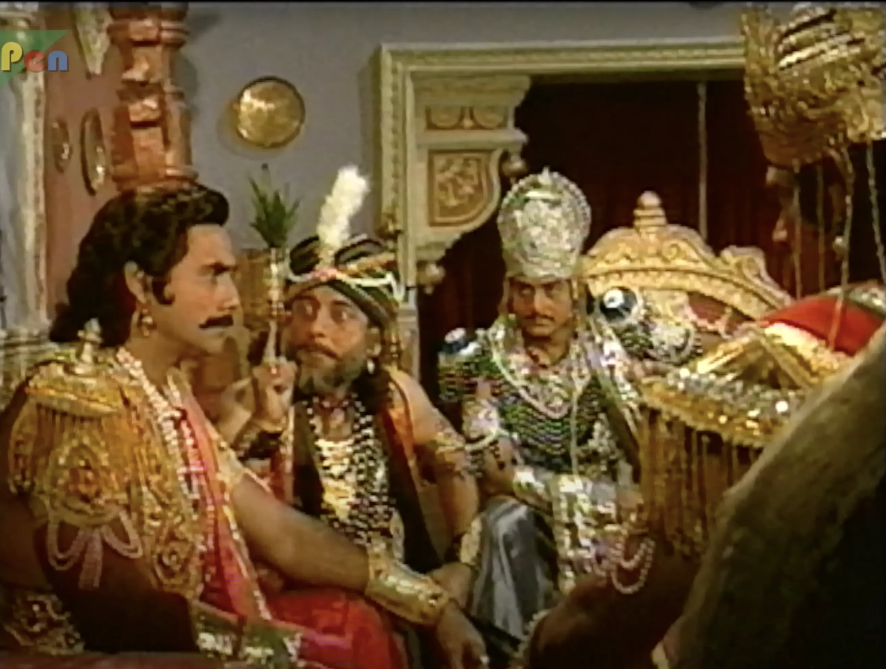

#### Subhadra Haran

**Note to the readers**: I have used the word _kidnap_ in the title, but it is not meant in the literal sense. As
Krishna said,

> अगर किसी के निर्णय से उसका हरण किया जाए, तो उसे हरण नहीं, वरन कहा जाता है।

#### Synopsis

On Krishna's advice, Arjun leaves to build alliances for the upcoming war with Subhdra, Krishna's sister. Shakuni
realizes this and plans the next course of action. He also sends Duryodhan to marry Subhadra. Duryodhan while sparring
with Balram wins the match. Balram tells him that he can give him anything he wants. Duryodhan asks for his help in
marrying Subhadra. Balram agrees to help him. The celestial Subhadra is introduced in a song sequence. Arjun meets her
while she was dancing in the rain. Krishna introduces them. Before Krishna can talk to Vasudev about their marriage,
Balram proposes Duryodhan's marriage to Subhadra, much to her dismay. Krishna orchestrates Subhadra's kidnapping by
Arjun. He advises Subhadra to go to a pooja, and Arjun to kidnap her there. Krishna warns him about Draupadi's reaction
when he brings her there. Arjun kidnaps Subhadra, prompting Balram to gather his warriors and wage war against him.
Krishna uses reason and persuasion to resolve the conflict.

#### Discussion

* The time sequences at the beginning of episodes is very important. Since the show aired a long time ago and many
  sources have uploaded it online, many things are skipped over. For example, in this episode the time sequence
  explained away how Arjun left for the yatra. His bow and arrow were kept in Draupadi's room. Then a brahman's cow was
  stolen and to fulfill his _kshtriya dharma_ and save the cow he had to get the bow and arrow. When this happened,
  Yudhisthir and Draupadi were already in the room and he barged in. To repent for this, he left on the pretense of
  Yatra. If he outright admitted he was going to marry Subhadra it would have caused a rift in the family.
* The fight sequences are a refreshing change from the usual dialogue heavy episodes. This time we get to see a _gada
  yuddh_ between Balram and Duryodhan when they were Sparring. Balram calls him the best _Gada yoddha_ in the world.
  This holds importance for events that happen during the war.
* Another lovely song sequence when the beautiful Aloka Mukherjee is introduced as Subhadra.
* This is another time Krishna calls Draupadi his sister. There will come a time when he will have to prove his kinship
  to her.
* Concept of marital alliances is very important in the Mahabharat. Krishna is always looking for ways to strengthen the
  Pandavs. Marriage, although a sacred bond of love also serves as an important political tool.
* Now we get to see the story that unfolds once Arjun brings back Subhadra and how Draupadi reacts to it. Shakuni's plan is foiled and we also have to see how they plan their next move.

#### Notable Dialogue

> सुभद्रा: कौन हैं आप?
>
> अर्जुन: यात्री हूँ।
>
> सुभद्रा: कहाँ-कहाँ की यात्रा की?
>
> अर्जुन: पूरे भारतवर्ष की यात्रा कर के यहाँ आया हूँ।
>
> सुभद्रा: अर्जुन को देखा है?

> रण-भूमि क्षत्रिय की ससुराल होती है, और अपनी ससुराल में पूरी तैयारी करके ही जाना चाहिए।

> काव्य की तो परिभाषा ही ऐसी है बहना, कि जो सुने वो कह उठे कि यही सत्य है।

> पिताओं को कभी अपनी कन्या साधारण नहीं दिखती।

> सीमाओं के घटने से कोई संतुष्ट नहीं होता।

> अपने जीवन के विषय में आज्ञा नहीं ली जाती। निर्णय लिया जाता है।

> स्त्री कोई पशु नहीं है, जो पुरस्कार बनाकर किसी को दे दी जाए। वह कोई वस्तु नहीं है कि हारी या जीती जा सके!

> सुभद्रा हरण से कहीं कठिन लक्ष्य है, सुभद्रा का द्रौपदी से मिलन।
---

