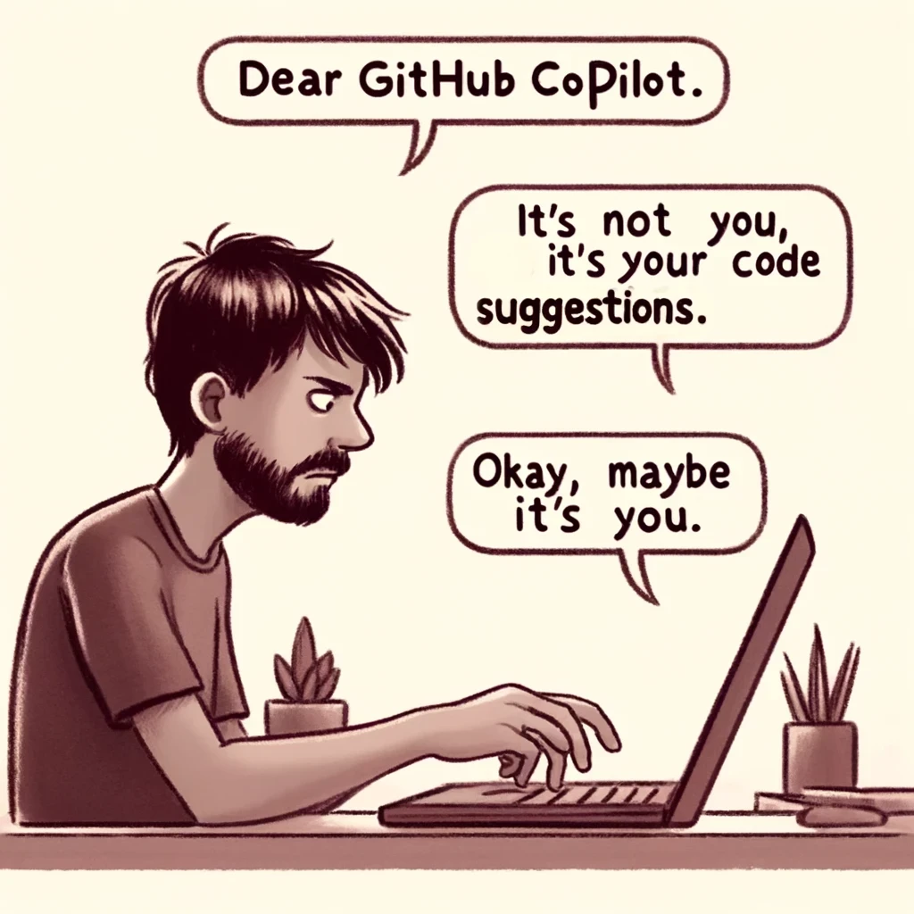

I have been using GitHub Copilot for the past few months now, and honestly it is pretty fun. It felt like the kind of
racy relationship that keeps giving you adrenaline every waking moment of it, until it doesn't...

So here I am writing about my break-up with copilot and the end of our three-month-long affair.

## The honeymoon period

I had heard of and read about copilot for quite some time now, but never felt the need to use it, until I started
working on a large codebase for a personal project. On recommendation from a friend I installed it and my god it was
magical. Writing boilerplate code and even complex functions like it was copying and pasting it from somewhere! (*wink
wink*
get it?) And I fell in love. I installed it on all my code editing software and started using it exclusively. I disabled
completions everywhere because copilot was my completer!

Now I would like to clarify that there is nothing inherently wrong with having an AI generate boilerplate code for you.
It is actually a lot more productive and this post is not trying to say that at all.

## The small conflicts

After a month I started noticing a few irregularities with the code it was generating. Some ghost parameters for a few
functions, importing libraries that did not even exist, and a few other things, but I brushed them off as just AI things
and fixed them myself. This was not something that was going to deter me from using my _trusted_ copilot. At some point
I even started using it in writing my blogposts. Before you get your pitchforks out, I used it to autocomplete spellings
of _Yudhisthir_ and _Dhritrashtra_ mostly. It hallucinated fabricated stories of a character marrying his sister or
something as well. It was now showing its true colors to me.

## The breaking point

All of the above things were still acceptable to me, since they were mistakes that could be corrected. This one
incident, on the other hand made me ditch copilot in an instant. I began migrating my python project to go, partly
because I wanted to learn go and partly because my python code was like cold maggi. (See how I used maggi instead of
Spaghetti?). Anyway, back to the point. I started learning go, how a project structure in golang should be like, what is
the difference between how dependencies are handled in go, things like that. I decided on a plan and started writing
code and boy oh boy it was a breeze! Why wouldn't it be? I had my trusty copilot by my side.

Now I have been used to using ORMs for many years now and I don't remember a time when I had to write an actual SQL
query. On this project though, I decided that I wanted to use raw SQL instead of an ORM. I went with
using [sqlc]("https://sqlc.dev") to generate go code for my SQL queries, and it worked fine as well. What happened
today,
is why I decided to ditch copilot.

I wanted to update a user, but I wanted to send the request with partial data like in an ORM.
For example, if I wanted to update a user, I could just send

```json
{
  "id": 69,
  "username": 420
}
```

and it should update the username of the user with id 69.

Here is the query that copilot wrote for me:

```sql
UPDATE "user"
SET username         = $2,
    email            = $3,
    phone            = $4,
    password         = $5,
    role             = $6,
    business_name    = $7,
    business_phone   = $8,
    business_address = $9
WHERE id = $1
RETURNING *;
```

Here is what it should have been:

```sql
UPDATE "user"
SET username         = COALESCE($2, username),
    email            = COALESCE($3, email),
    phone            = COALESCE($4, phone),
    password         = COALESCE($5, password),
    role             = COALESCE($6, role),
    business_name    = COALESCE($7, business_name),
    business_phone   = COALESCE($8, business_phone),
    business_address = COALESCE($9, business_address),
    updated_at       = NOW()
WHERE id = $1
RETURNING *;
```

Now if I keep letting copilot write my queries, then how the hell am I going to learn it? I learned about COALESCE by
the good old-fashioned way of googling. You know what chatGPT suggested?

```sql
-- name: UpdateUserUsername :one
UPDATE "user"
SET username = $2
WHERE id = $1
RETURNING *;

-- name: UpdateUserEmail :one
UPDATE "user"
SET email = $2
WHERE id = $1
RETURNING *;

-- name: UpdateUserPhone :one
UPDATE "user"
SET phone = $2
WHERE id = $1
RETURNING *;

-- name: UpdateUserPassword :one
UPDATE "user"
SET password = $2
WHERE id = $1
RETURNING *;

-- name: UpdateUserRole :one
UPDATE "user"
SET role = $2
WHERE id = $1
RETURNING *;

-- name: UpdateUserBusinessDetails :one
UPDATE "user"
SET business_name    = $2,
    business_phone   = $3,
    business_address = $4
WHERE id = $1
RETURNING *;

```

It wanted me to created separate functions for all the update fields and run those queries accordingly.

This led me to think back on all the times copilot was wrong for me. For every time I had to sit back and check its
faulty code. For everytime a small bug bothered me for hours because I trusted copilot a little more than I should have,
For all the times it made someone's wife their sister just because the data churning machine said so
and for all the times I could have learned something but instead trusted a computer to do my job for me.

Writing boilerplate _is_ how you learn new stuff. It's how you get better at stuff. Searching online, reading
documentation is how you get better at stuff.

Thus ends my rant. So, goodbye copilot, it was fun while it lasted.


