These are some photos I clicked when I was in 12th grade in Delhi Public School
Rajkot. The pigeons loved the terrace of our school and I had a lot of free
time after school since I lived in the hostel. The camera belonged to our P.T.
teacher. Also, Some random dude on reddit told me that I have a _natural eye
for framing_. Enjoy some pigeons and flowers.

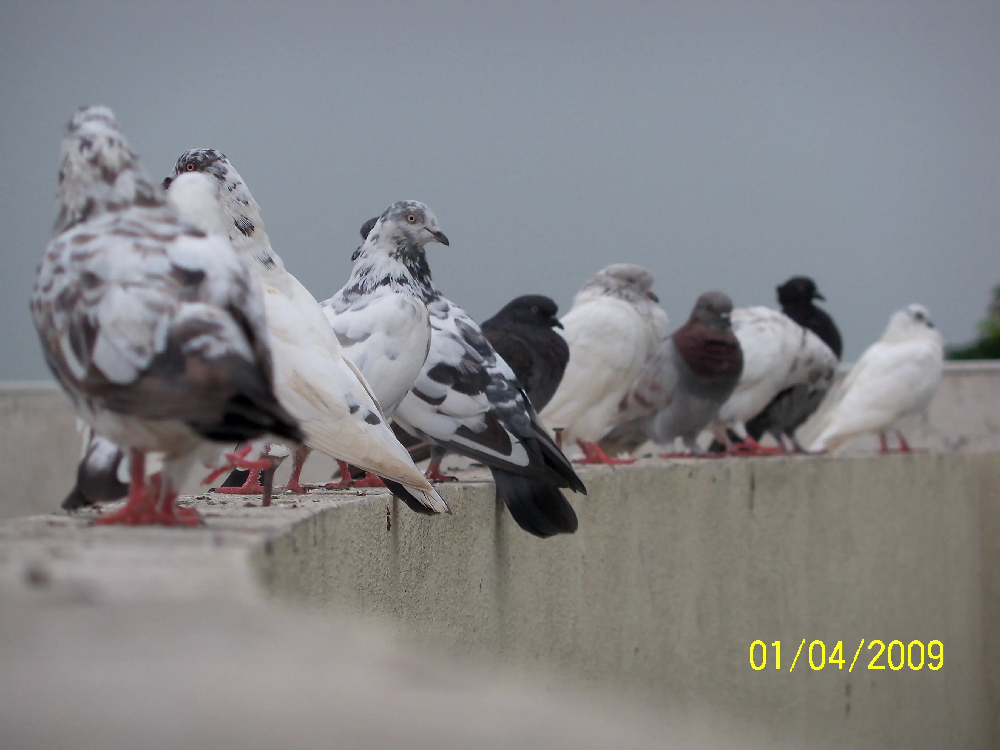
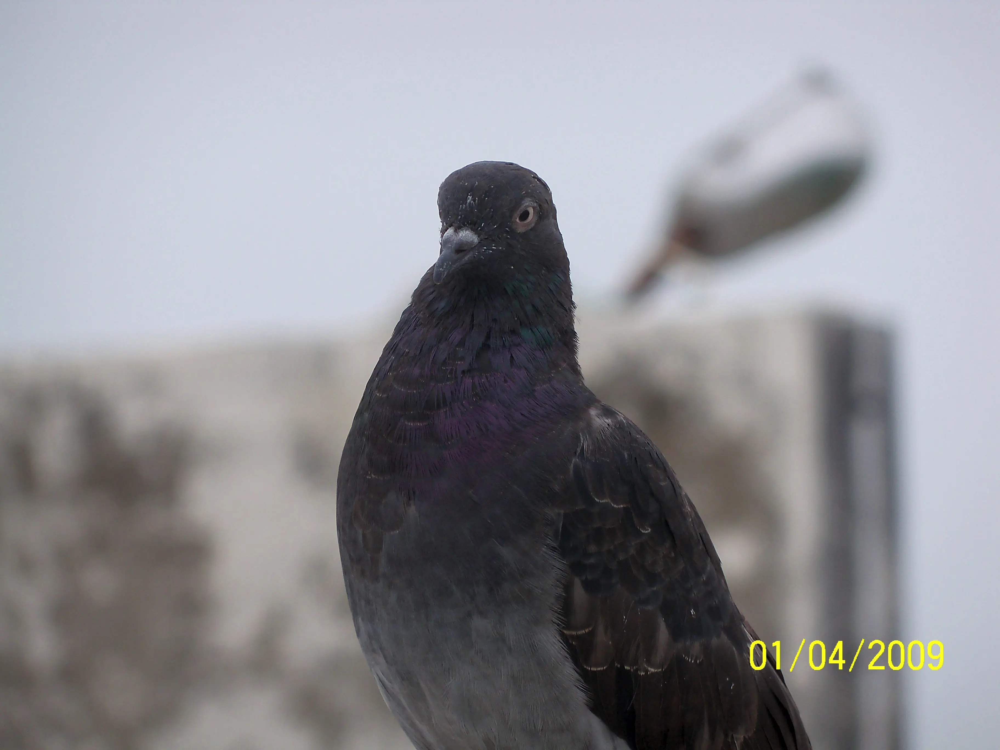
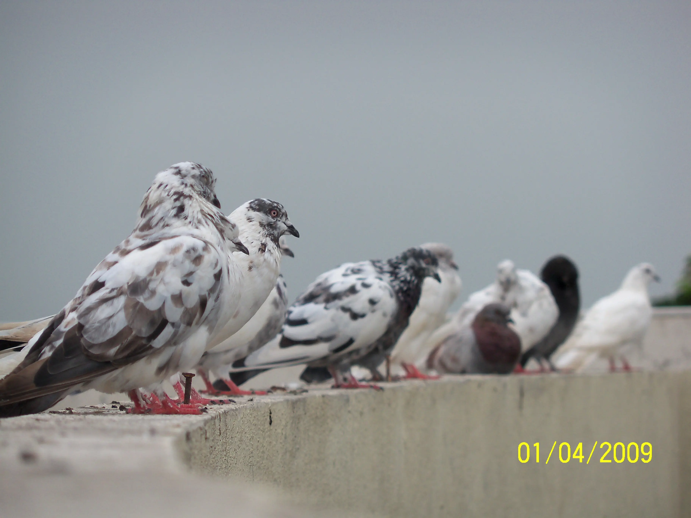
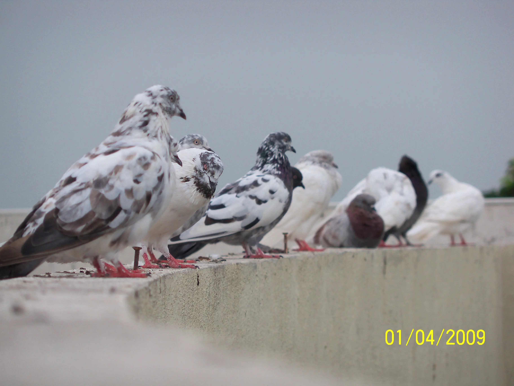
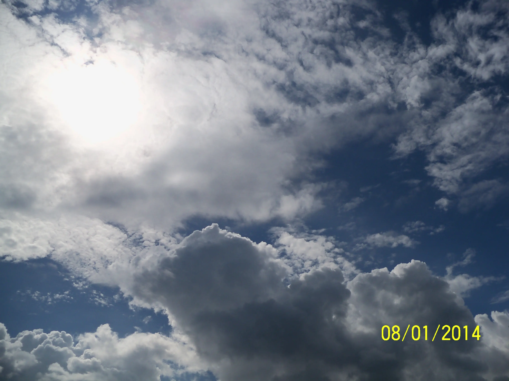
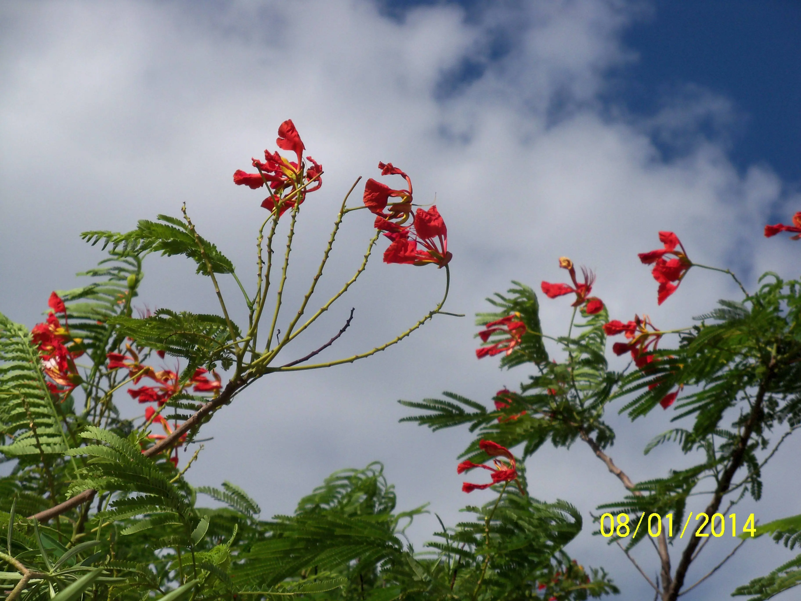
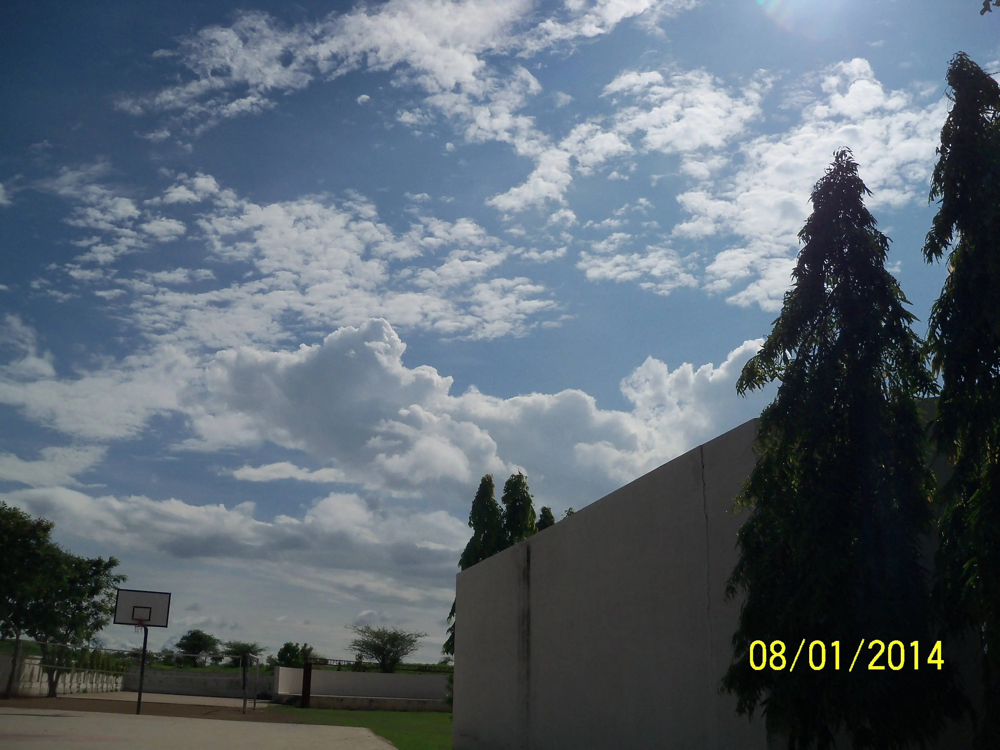
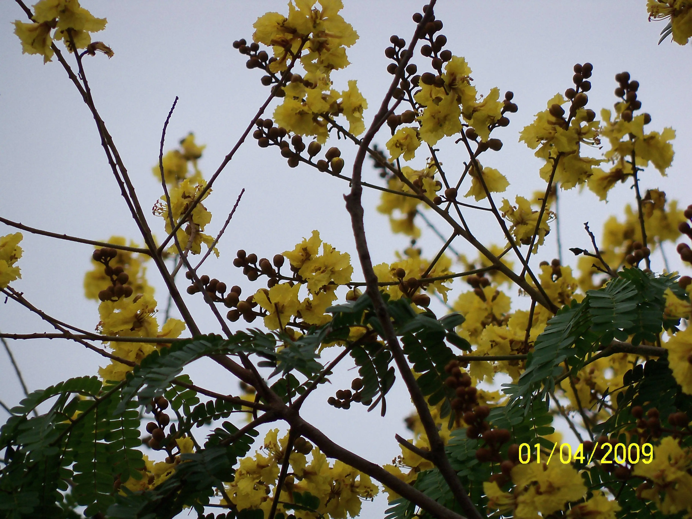
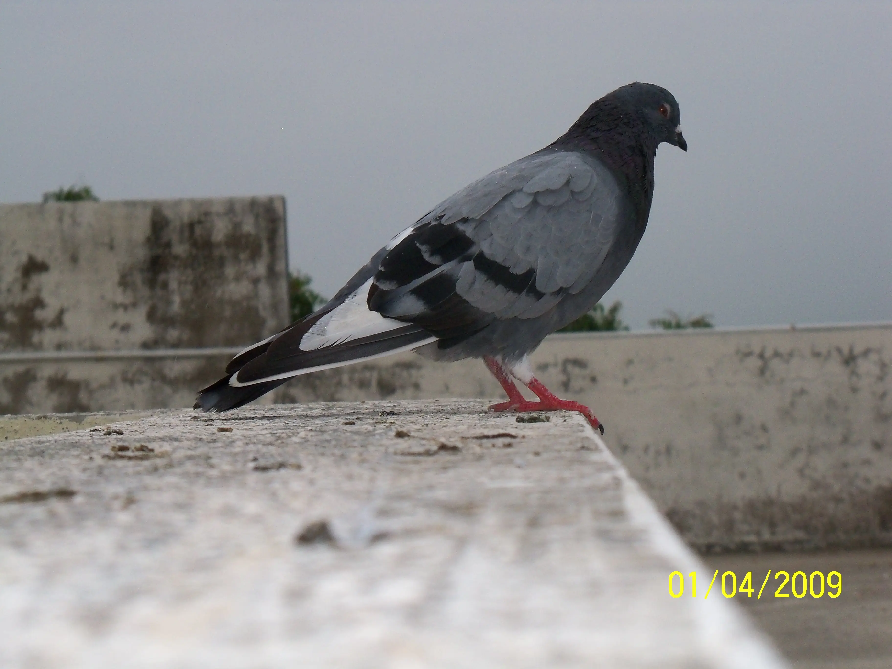
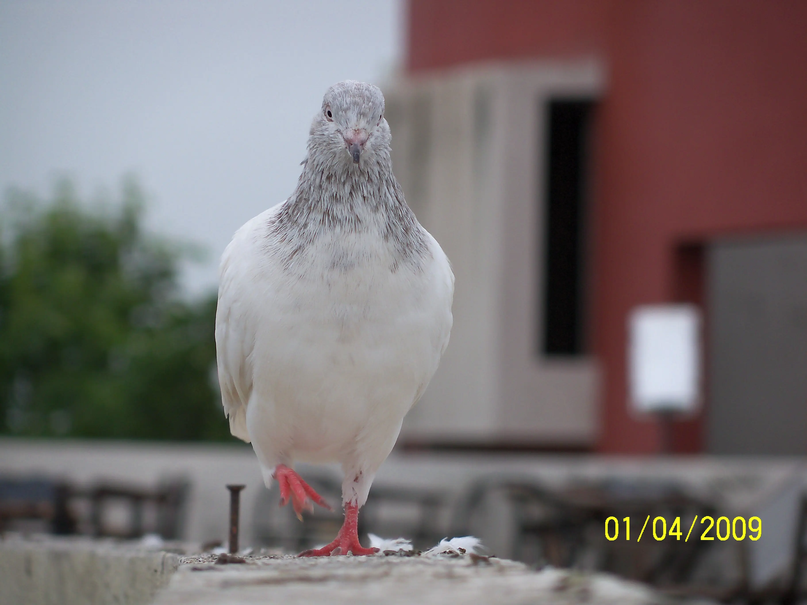
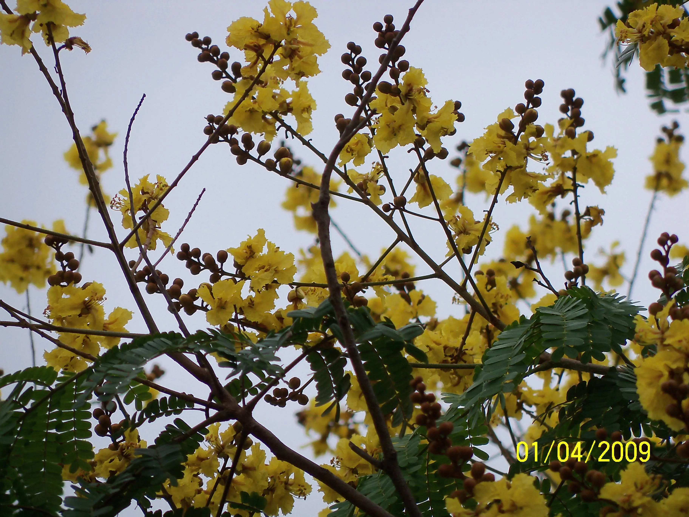
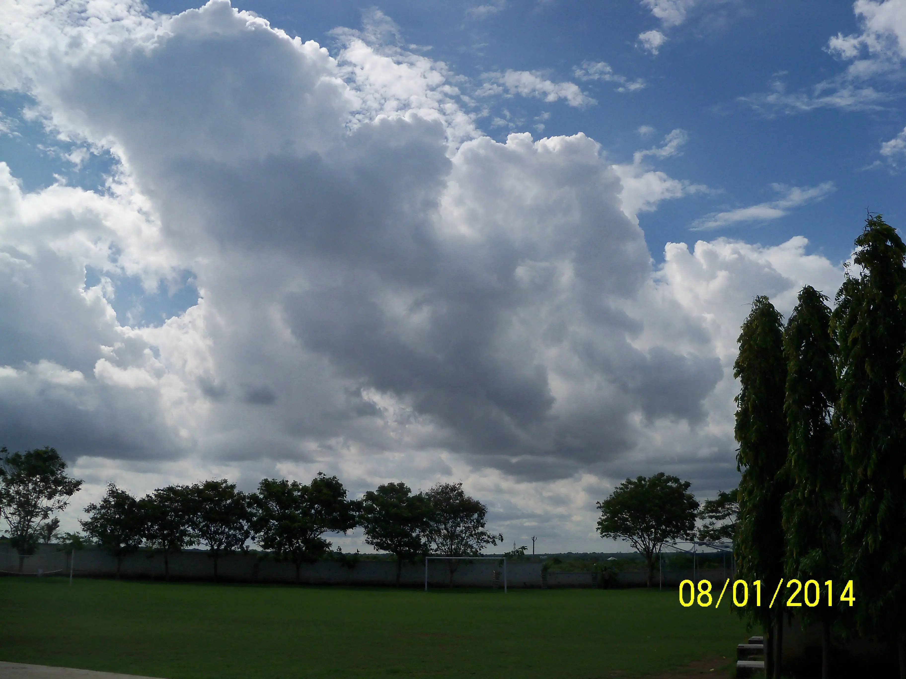
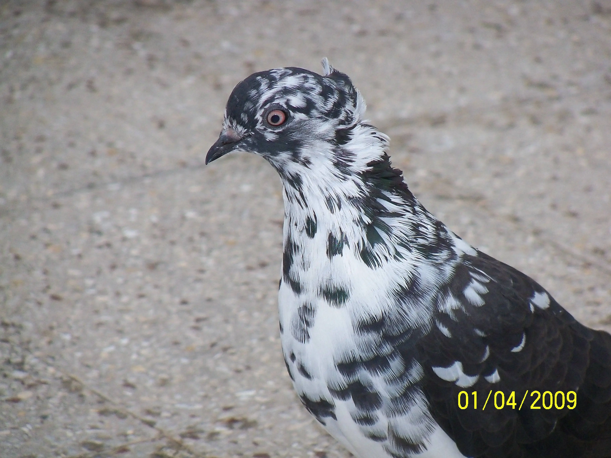
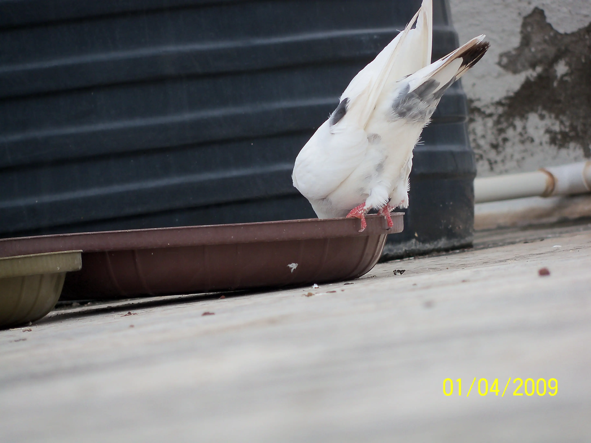

