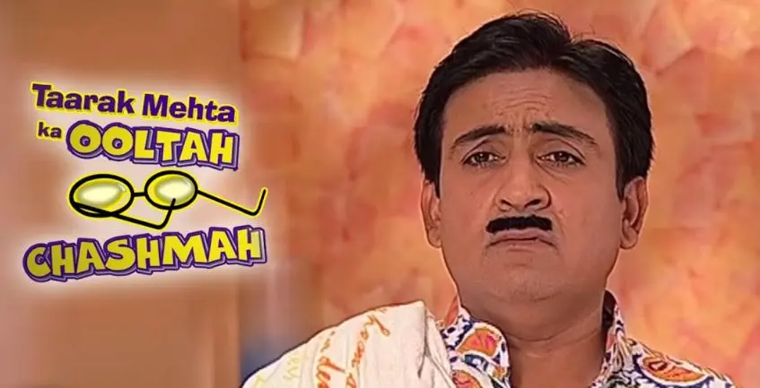

Taarak Mehta is a name that almost every Indian within a hundred meters of a TV
connection should know. It is after all, one of the most beloved comedy TV
shows in the Indian market. It is based on _Duniya ne undha chashma_ (A world
with inverted glasses), a weekly magazine column. In the beginning it did try
to stay true to the source material like all TV shows always do, but gradually
over the period of TEN long years, it has simmered down into a hot pile of
monotonous episodes that are more predictable than the direction of a turtle's 
movement. 

After rewatching some initial episodes, the stark difference between the old
TMKOC and the new one is painfully obvious. The old one can be described as a
_daily sitcom with heavy satirical undertones of Indian culture_ while the new
one is.. well, I don't know what it is. If you look at the early episodes, the
show was self-aware. The characters were not monochromatic, they had their
flaws and they were aware of them. Gokuldham "family" as it is known these days
did not exist. Everyone had humane qualities. The neighbors were not all
_happy-go-luckys_ who were always ready to help each other no matter what. They
were sometimes envious of each other, were condescending to others and had their own
flaws and patterns that were not visibly fake. On the other hand, the show that
airs today is a series of repetitive story arcs that lead nowhere and exist
solely for the reason of making money off of the _brand_ that is TMKOC. Everyone
is loving and happy and caring and no one on this society has ever done anything
_remotely_ wrong at any point in their lives. It's like everyone is forced to smile
and be happy forever.

Looking at the state of TMKOC today, you could not fathom that the show would
be capable of global political satire, and yet at one point in the early
episodes, it provides stark commentary on the USA-Israel situation. 
But such is the bane and boon of television in India. It has to be catered to a
particular taste of the audience, and at that point it stops becoming what it
is and starts to become what it is _expected_ to be. What it loses in spirit,
it gains in TRP and income. When TMKOC first soared in popularity, celebrity
placements were sparse. Every few weeks a new celeb would join the cast for an
episode promoting their movie. It was a fun change of pace from the fantastic
comedy that the show provided back in the day. But as time passed, the
promotions became more frequent and thus the quality degraded. 

Looking at it now, even the promotions are low in number, but the show goes on.
It doesn't matter if the jokes are dead or the characters are uninteresting
anymore. **THE.SHOW.STILL.GOES.ON.** All the jokes are same, stereotypical
nonsense that the writers have been spewing for the past few years. Even some
actors have left the show but it still goes on. 
The question remains, is it still the ship of Theseus after all the parts are 
replaced?

In the end, I would suggest you all to rewatch the early days of the series and 
relive the show that stole the hearts of Indian audiences in its early days.
