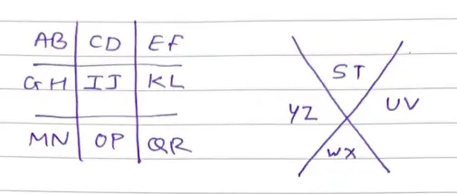

This is a method to encode text I learned from my cousin when I was a kid. I
thought it was the most awesome thing in the world back then! Basically the
letters of the alphabet are arranged in pairs of two in two symbols, a **#**
and a **X** like the below image.

If you want to write the first letter of any pair, draw the symbol surrounding
that pair, and if you want to write the second letter draw the same symbol but
put a dot in the middle. It is so simple its silly. 

The fun part is, you can change the order of the letters and only the one with
the right key will be able to decode your message. Here is the alphabet with
the above key, and below it is a secret message which you can decode and write
in the comments.

Hope you find this interesting and make some more cool things out of it!
