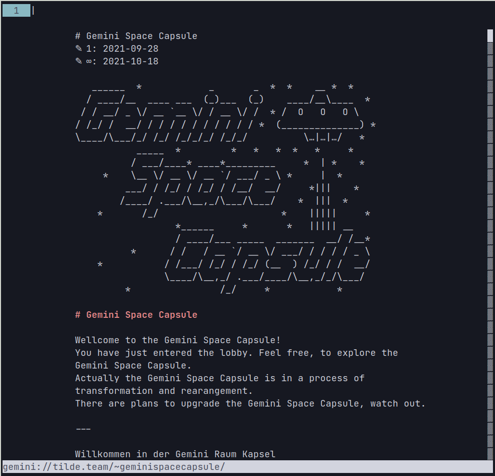

For quite a long time now, I have been trying to get away from the "modern"
web. The corporate hosted content farms that serve as nothing but money making
machines no longer appeal to me. I don't care about little hearts in my
notifications that release chemicals in my brain to make me feel good. It
started with this website. I moved all my content(poetry, artworks, writings,
programs) to my own hosting and started serving them from my own little place
in the internet. I will admit, it was a pain at first. Hand constantly flicking
toward the phone to open apps that did not exist, bouts of extreme boredom that
_just won't end_, and other such things. But I succeeded.

Now instead of scrolling on my phone endlessly, I would go to a select few
websites which were not chock-full of content but meticulously maintained. This
led me to meet groups of people with similar mindsets and thus I was introduced
to [The Gemini Protocol](https://gemini.circumlunar.space/).

According to their website, Gemini is a new internet protocol which:

- Is heavier than
  [gopher](https://arstechnica.com/tech-policy/2009/11/the-web-may-have-won-but-gopher-tunnels-on/)
- Is lighter than the web
- Will not replace either
- Strives for maximum power to weight ratio
- Takes user privacy very seriously

Basically, it is a lighter web. There is text, there are links to different
texts, there are files and there is text input in some places. It is a text
based web protocol. There are no images or animations or videos. Now I won't go
into detail about what gopher is and the technical specifications because that
would make this post a **BORE** to read. Rather I will try to list how Gemini
has turned out to be a safe haven for people exhausted by algorithmic content
created by corporate powerhouses. Each site there is unique, with stuff written
by web enthusiasts who just want to be a part of something bigger. Gemini sites
need a special client to open, since it is an entirely different protocol. 

Instead of `http://site.com` they have an address like `gemini://site.com`.
This hassle of setting up a client to access Gemini is in my opinion definitely
worth it. Many proxies exist as well for accessing Gemini via traditional web
browsers. There are some sites that also provide service for creating
"gemlogs", via webforms. Gemlogs are blogs in gemini sites, which can be
accessed via gemini as well as an http proxy. The first one that comes to mind
is [The midnight pub](https://midnight.pub), a virtual pub where people talk
about stuff like they would at a regular bar. Users can make small gemlogs that
are visible to everyone and can be commented on(currently only via http). It is
pure text, no images, no distractions. Just words. It is truly a beautiful
thing. I hope you check it out. There is no need to go through the pain of
hosting your own gemini capsule, there are countless free hosts available. If
you care about genuine interactions are looking to recapture the genuineness of
the old web, Gemini is the place to be. I will also be working on porting my
website to Gemini soon, so stay tuned for that!

I have shared some sites below for further reference. See you in space!

References

* [Gemini FAQ](https://gemini.circumlunar.space/docs/faq.html)
* [Gemini Quickstart Guide](http://geminiquickst.art/)

Some Gemini sites (credits to respective owners): 

 

